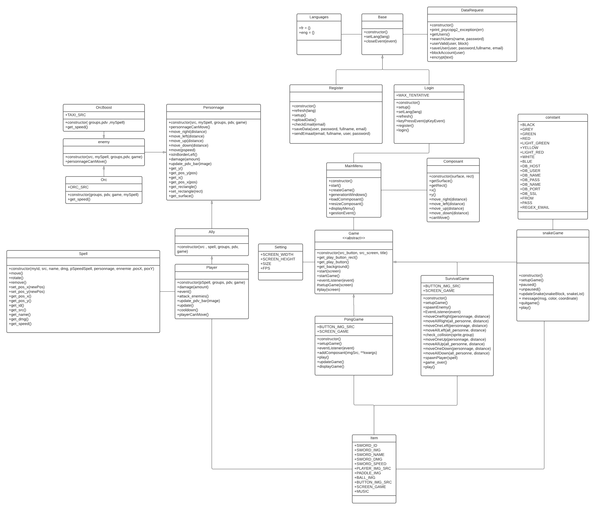
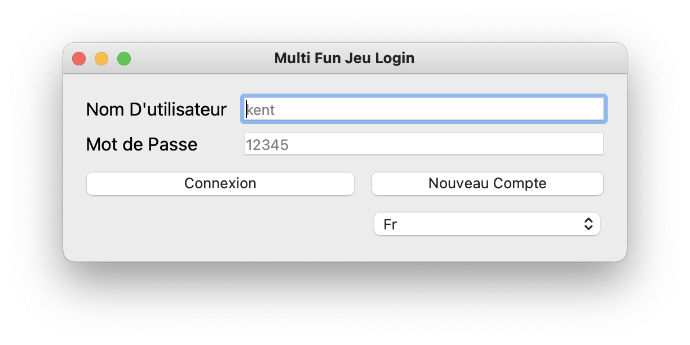
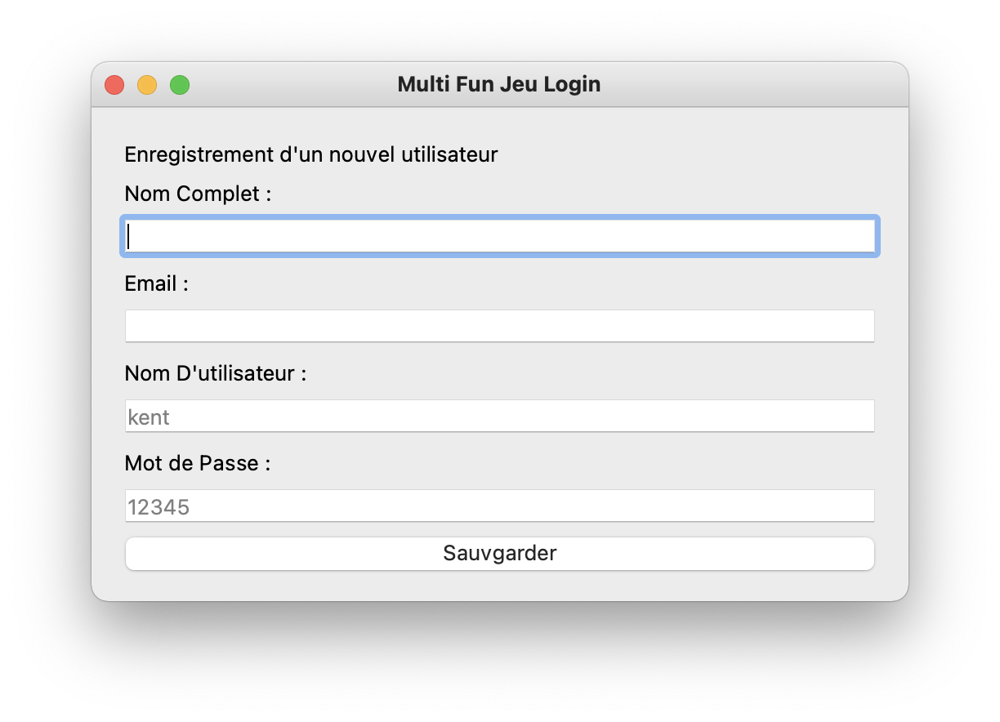
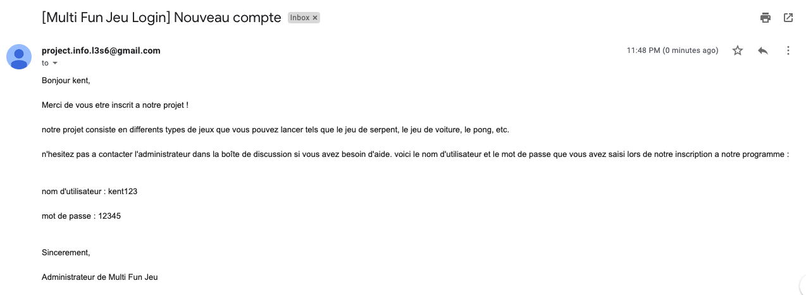
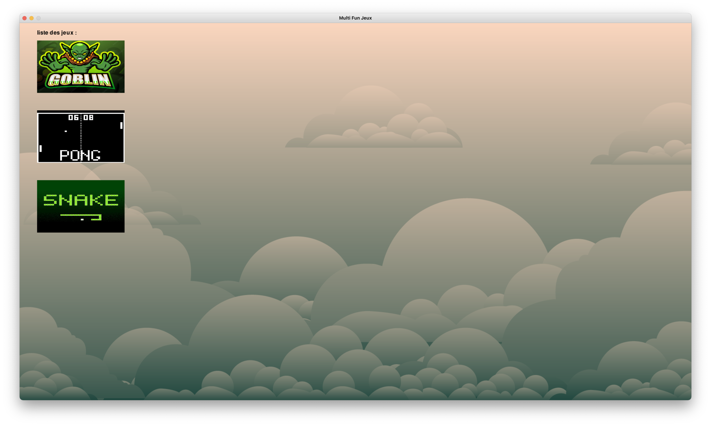
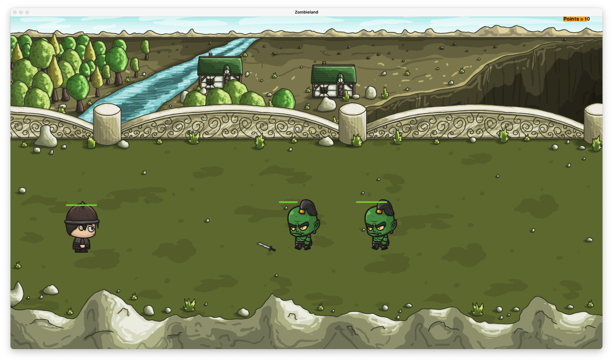
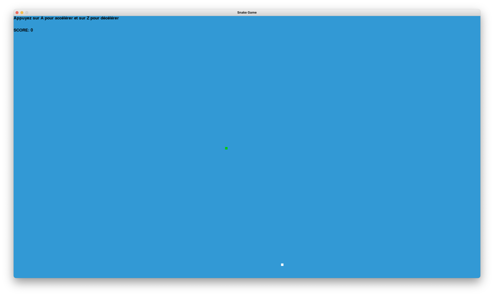
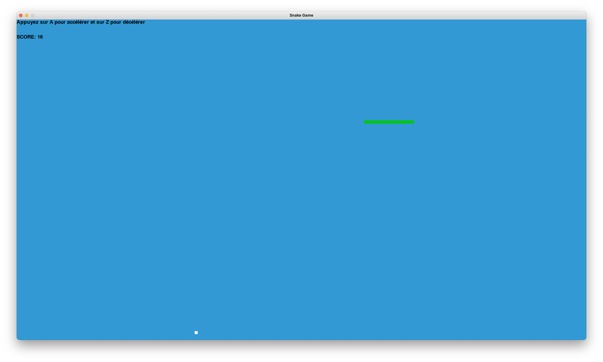

# Project S6 - Multi Fun Jeu

## Membres du groupe

Ce travail est à réaliser en équipe dont les membres sont (**S6 Licence 3 Informatique**) :

- BENEDICTUS KENT **RACHMAT**
- HICHEM **KARFA**

## Sujet

Sur ce projet, nous construisons une application qui permet à l'utilisateur de sélectionner différents types de jeux et ils ont leur propre compte pour jouer au jeu. pour exécuter le jeu, l'utilisateur peut également choisir sa propre langue lors de la création du compte, et le compte sera également enregistré dans la base de données de l'université avec un mot de passe crypté.

ce programme peut fonctionner parfaitement grâce à pygame et pyqt et à d'autres bibliothèques que nous avons importées.

## Installation

!!! IMPORTANT !!!
vous devez utiliser le VPN ou l'ordinateur de l'université car notre base de données utilise le postgre de l'université

```bash
$ main/src> python3 login.py
```

## UML



## Fonctionnalité

- formulaire de connexion en anglais et français, le login fonctionnera une fois que vous aurez un nom d'utilisateur et un mot de passe sur notre serveur. Si vous vous êtes inscrit et que vous avez oublié votre mot de passe, veuillez ne pas essayer plus de 2 fois car votre compte sera bloqué et le redémarrage du programme ne changera pas la condition. merci de contacter l'admin pour débloquer (benedictuskent.rachmat.etu@univ-lille.fr)
  

- formulaire d'inscription, la validation du formulaire vous alertera en cas d'erreur, il y a aussi un email pour vous rappeler le nom d'utilisateur et le mot de passe que vous avez entré, veuillez donc entrer le bon email, une validation regex vérifiera votre email.
  
  

pour tester le fonctionnement de cette entrée, vous pouvez l'essayer sur le formulaire, par exemple le formulaire d'inscription, si vous entrez le même nom d'utilisateur que votre ami qui s'est inscrit, vous ne pourrez plus l'utiliser. Si vous entrez le mauvais format d'e-mail, vous aurez une alerte, etc.

Si tout est correct, vous recevrez normalement un e-mail de notre e-mail personnalisé

- menus du multi jeu, pour le moment il y a 3 jeux auxquels vous pouvez jouer
  

- le jeu de survival est un jeu joué avec une seule personne et le but est de gagner en tirant une épée sur les ennemis, le joueur mourra si la barre de santé est à 0. l'ennemi viendra au hasard sur votre personnage et vous devez l'éviter en utilisant vos flèches dans le clavier, flèche haut pour monter, flèche bas pour descendre, etc. vous pouvez également tirer avec votre arme sur l'ennemi pour le tuer en cliquant sur la souris, si la santé de l'ennemi a disparu, l'ennemi disparaîtra.
  
  

pour tester le jeu si vous tuez un ennemi, c'est que votre personnage gagnera 10 points (et plus 10 pour la suite) mais si vous mourez sans tuer d'aliens, vous obtiendrez 0 points.

- un jeu de pong est un jeu joué à 2 personnes, et le but est de gagner en faisant rebondir la balle du côté adverse avec la raquette fournie. pour le joueur 1, veuillez utiliser s et z pour monter et descendre et le joueur 2 utilise la flèche vers le haut et vers le bas, et essayez de tenir votre base ou l'adversaire gagnera le point.
  

- un jeu de serpent est un jeu joué avec une seule personne et le but est de manger la nourriture blanche et de faire grossir le serpent jusqu'à ce qu'il meure en mangeant son propre corps ou en sortant de la boîte. Appuyez sur a et z pour accélérer et décélérer respectivement, et si vous perdez le score sera affiché dans le menu principal, si vous voulez rejouer appuyez sur c sinon appuyez sur q.
  il y a aussi une musique dedans, allez essayer !
  
  

Pour tester si ce code fonctionne, si vous mangez 10 aliments blancs, vous obtiendrez 10 points et la longueur de votre serpent sera 10 plus grande que la première, mais si vous mourez sans nourriture, le point sera 0

## Stucture du projet

Nous trouvons à la racine du projet un dossier main dans lequel se trouve trois dossiers,
le dossier src contient tout le code du projet, et le dossier image et music contient les éléments externe du code.

```bash
.
├── README.md
└── main
    ├── image
    │   ├── bg
    │   │   ├── foggy.png
    │   │   └── game
    │   │       ├── PNG
    │   │       │   └── game_background_4
    │   │       │       └── game_background_4.png
    │   │       └── pong
    │   │           └── pongTerrain.jpg
    │   ├── button
    │   │   └── mainMenu
    │   │       ├── goblin.PNG
    │   │       ├── pong.jpg
    │   │       └── snake.jpeg
    │   ├── car
    │   ├── enemy
    │   │   └── orc.png
    │   ├── player
    │   │   ├── Sword.png
    │   │   └── Warrior.png
    │   ├── preview
    │   │   ├── email.png
    │   │   ├── login.png
    │   │   ├── menu.png
    │   │   ├── pong.png
    │   │   ├── register.png
    │   │   ├── snake.png
    │   │   ├── survival1.png
    │   │   ├── survival2.png
    │   │   └── uml.png
    │   └── snake
    │       └── apple.png
    ├── music
    │   ├── crash.wav
    │   └── jazz.wav
    └── src
        ├── ally.py
        ├── base.py
        ├── composant.py
        ├── constant.py
        ├── dataRequest.py
        ├── enemy.py
        ├── game.py
        ├── item.py
        ├── languages.py
        ├── login.py
        ├── mainMenu.py
        ├── orc.py
        ├── orcBoost.py
        ├── personnage.py
        ├── player.py
        ├── pongGame.py
        ├── register.py
        ├── setting.py
        ├── snakeGame.py
        ├── spell.py
        └── survivalGame.py

16 directories, 43 files
```

Merci d'avoir joué et à la prochaine
