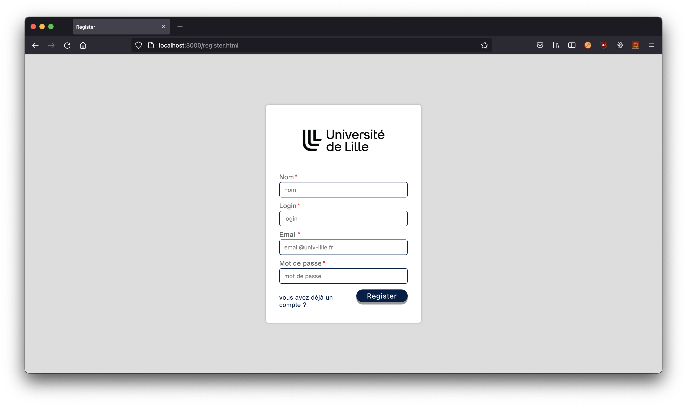
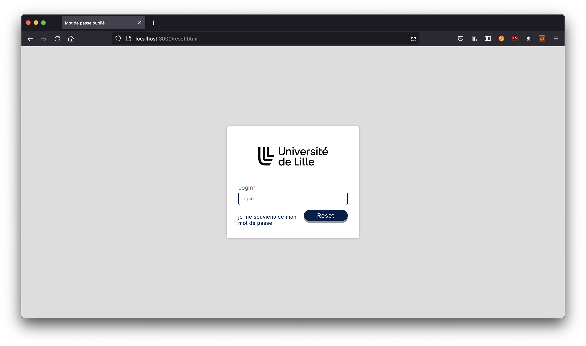
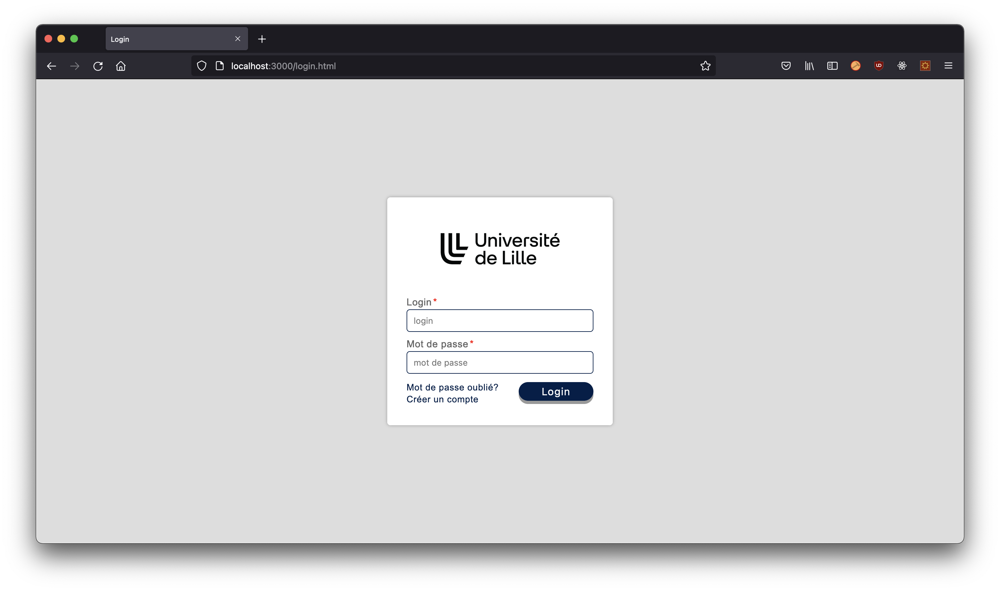
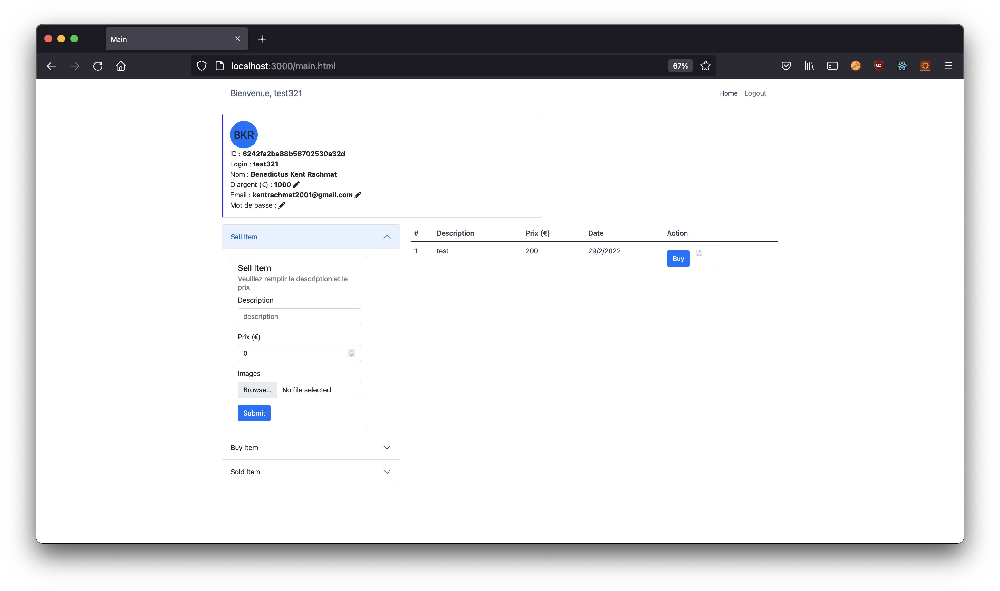
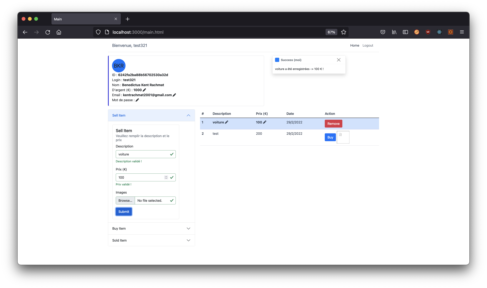
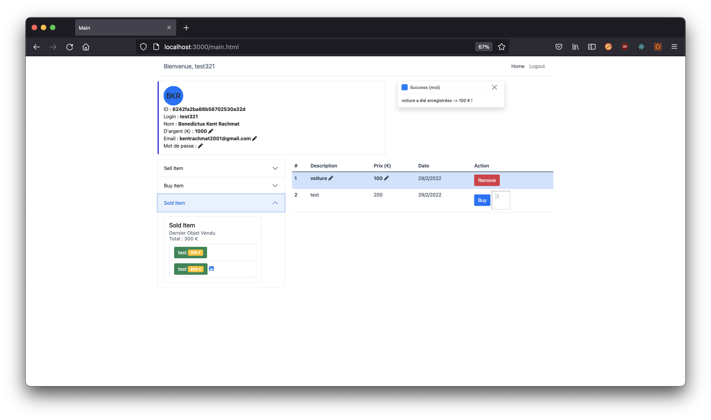
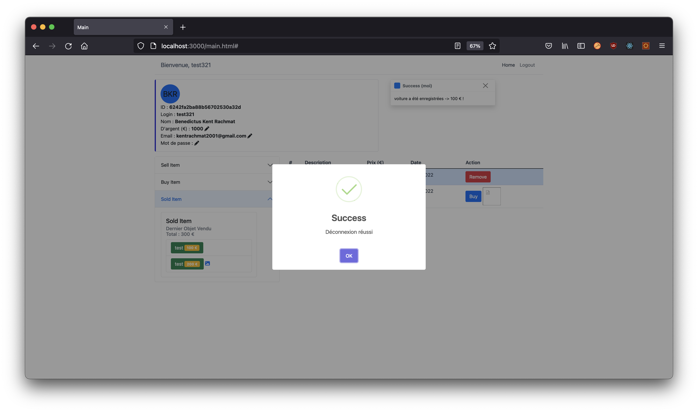

# TP4 - Vendez les vôtres

## Installation

Tout d'abord. Vous devez exécuter la commande `npm install` dans le serveur et le client pour installer toutes les dépendances du projet.

Pour exécuter le code veuillez vous utilisez cette commande :

- le côté client (ReactJS)

```bash
client> npm run watch
ou
client> npm run build
```

- le côté serveur (Express.js)

```bash
server> nodemon
ou
server> npm run start
```

- le basse de donné (MongoDB):

```bash
$ mkdir dbdata
$ mongod --dbpath dbdata
```

utilisez cette commande si vous souhaitez interagir avec la base de données

```bash
$ mongo
```

une fois que tout est compilé et démarré, vous pouvez accéder à cette url : http://localhost:3000

## Informations sur le projet

Tout le code a été implémenté correctement.

Dans ce projet, nous avons appris à utiliser Express.js pour notre back-end, ReactJS pour notre front-end et MongoDB pour notre base de données. De plus, nous avons implémenté comment utiliser l'API REST telle que POST, PUT, GET et DELETE.

Le jeton JWT est également utile pour créer notre page de connexion, nous utilisons également une bibliothèque `nodemailer` pour envoyer des e-mails (nous avons créé notre propre e-mail pour ce projet particulier). le webpacak est également utile pour ce programme car il peut directement compiler les fichiers necessaire dans le répertoire `public/` de notre serveur. nous créons également du CSS et importons des bibliothèques telles que Swal, Bootstrap, FontAwesomeIcon, etc. pour rendre notre site web plus beau. Ce qui rend ce projet intéressant, c'est qu'en utilisant la bibliothèque `multer`, nous pouvons télécharger des images et rendre le programme plus sophistiqué. Finalement, nous avons utilisé la fonction `socket.io` pour communiquer avec le serveur, cela est très utile pour créer une notification lorsqu'un autre utilisateur a fait une action.

## Fonctionnalité

- Formulaire d'inscription avec expéditeur d'e-mail
- Formulaire de mot de passe oublié avec l'expéditeur de l'e-mail
- Formulaire de connexion avec authentification jeton JWT
- Achat de produit
- Vendre un produit avec un titre, un prix et une image personnalisés,
- supprimer le produit de la liste
- modifier les données personnelles
- modifier le produit dans la liste
- notification lorsque quelqu'un utilise une action
- voir les données vendues, achetées et listées
- fonction de déconnexion.

On peut ensuite explorer :

- Il faudra commencer par créer un utilisateur : `http://localhost:3000/access/register`

  

- Si vous avez oublié votre mot de passe vous pouvez vous rendre sur ce site pour réinitialiser votre mot de passe : `http://localhost:3000/access/reset`

  

- Une fois votre compte créé, vous pouvez vous rendre sur cette page : `http://localhost:3000/`

  

- Après vous êtes connecté à notre application, les informations et le solde seront affichés dans le menu principal, et vous pourrez modifier vos données et interagir avec l'application.

  

- Le formulaire à votre gauche est de vendre votre produit et de le mettre sur la liste pour qu'il soit vu par tout le monde, toutes les entrées sont obligatoires sauf le téléchargement de l'image.

  

- Une fois votre produit vendu, vous pouvez voir l'historique en cliquant sur l'accordéon sous le menu de vente, de même que l'historique du produit acheté.

  

- Si vous avez fini d'utiliser l'application, vous pouvez vous déconnecter et la page vous redirigera vers le formulaire de connexion.

  

## Arborescence du projet

```bash
.
├── README.md
├── client
│   ├── package-lock.json
│   ├── package.json
│   ├── src
│   │   ├── components
│   │   │   ├── app.jsx
│   │   │   ├── buttons.jsx
│   │   │   ├── formBuyer.jsx
│   │   │   ├── formInput.jsx
│   │   │   ├── formSeller.jsx
│   │   │   ├── formSold.jsx
│   │   │   ├── header.jsx
│   │   │   ├── informations.jsx
│   │   │   ├── notification.jsx
│   │   │   ├── tableSelling.jsx
│   │   │   └── updateInformations.jsx
│   │   ├── html
│   │   │   ├── login.html
│   │   │   ├── register.html
│   │   │   └── reset.html
│   │   ├── img
│   │   │   └── logo.png
│   │   ├── javascripts
│   │   │   └── main.js
│   │   ├── main.html
│   │   ├── scripts
│   │   │   ├── login.client.js
│   │   │   ├── register.client.js
│   │   │   └── reset.client.js
│   │   └── stylesheets
│   │       └── registration.css
│   ├── vendor
│   │   ├── react-dom.development.js
│   │   └── react.development.js
│   └── webpack.config.js
├── images
│   ├── book1.jpeg
│   ├── book2.jpeg
│   ├── car1.jpeg
│   ├── moto1.jpeg
│   └── preview
│       ├── login.png
│       ├── logout.png
│       ├── main.png
│       ├── register.png
│       ├── reset.png
│       ├── sell.png
│       └── sold.png
└── server
    ├── app.js
    ├── bin
    │   └── www
    ├── config
    │   ├── db.config.js
    │   ├── email.config.js
    │   └── jwt.config.js
    ├── controllers
    │   ├── access.controller.js
    │   ├── db.controller.js
    │   ├── error.controller.js
    │   ├── index.controller.js
    │   └── main.controller.js
    ├── img
    ├── lib
    │   ├── email.lib.js
    │   └── functions.lib.js
    ├── middlewares
    │   ├── authentication.middleware.js
    │   ├── error.middleware.js
    │   └── io.middleware.js
    ├── models
    │   ├── items.model.js
    │   └── user.model.js
    ├── package-lock.json
    ├── package.json
    ├── routes
    │   ├── access.route.js
    │   ├── index.route.js
    │   └── main.route.js
    ├── upload
    └── views
        └── about.pug

22 directories, 61 files
```

Merci d'utiliser notre application
