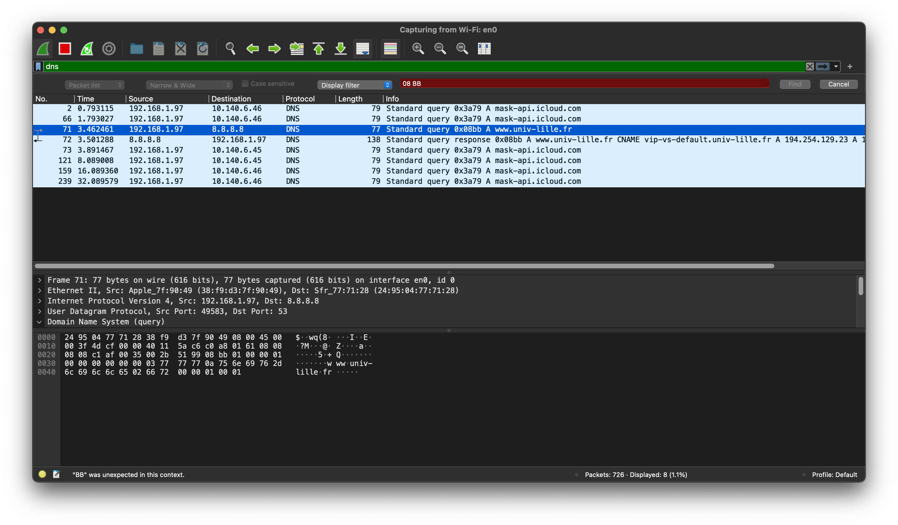
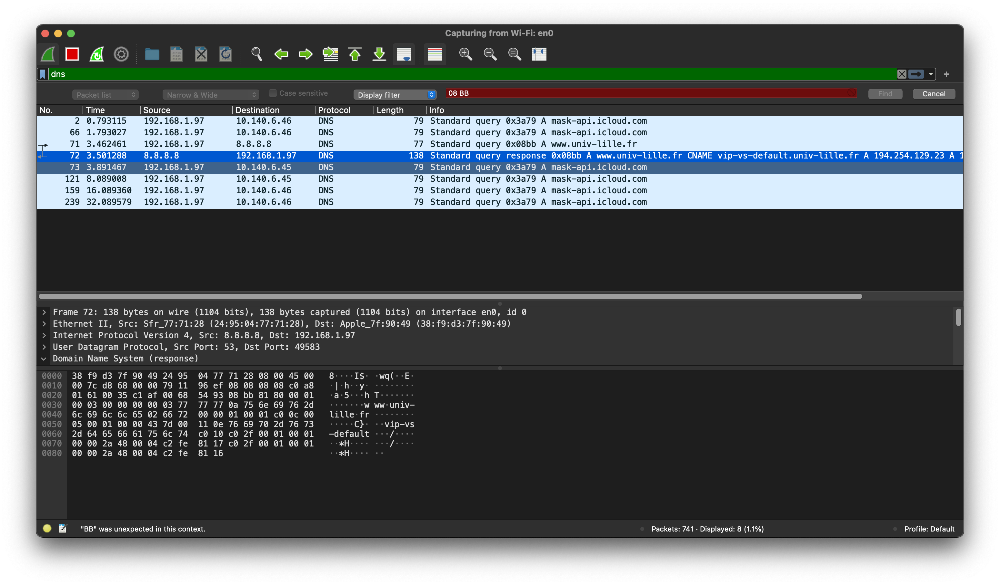

# Rapport pour le TP1 : Interrogation d’un serveur DNS

Ce travail est à réalisé par BENEDICTUS KENT **RACHMAT** (**Groupe 1 du S6 Licence 3 Informatique**)

# Compilation

Pour compiler les fichiers sources, placez-vous dans le dossier tp1 et exécutez la commande :

```bash
$ make
```

Pour nettoyer le depôt, veuillez utiliser cette commande :

```bash
$ make realclean
```

## 1. Le protocole UDP

Veuillez exécuter le fichier de `receive.c` avant d'envoyer les messages. Utilisez cette commande pour exécuter le récepteur :

```bash
$ ./receive {PORT}
ex : ./receive 2022
Le serveur en mode écoute... (^C pour sortir)
127.0.0.1 > Bonjour utilisateur !!
```

Utilisez cette commande pour exécuter l'expéditeur (`send.c`) :

```bash
>> ./send {PORT} {IP ADDRESS DEST} {MESSAGE}
ex : ./send 2022 127.0.0.1 'Bonjour utilisateur !!'
Le message a été envoyé à l\'addresse : 127.0.0.1 | port : 2022
```

on peut voir quand j'envoie la requête au serveur l'outil wireshark a capturé le trafic et ça me montre correctement le message envoyé.


## 2. DNS : Domain Name Server

les questions ont été traitées correctement. dans cet exercice j'ai appris comment envoyer et recevoir des données DNS et de plus je peux analyser la requête contenant, comme on peut le voir quand j'envoie la requête au serveur l'outil wireshark a capturé le trafic et ça me montre correctement le domaine que je suis à la recherche de. l'image de gauche montre la requête lorsque j'envoie au serveur et l'image de droite est la requête que j'ai reçue.

|         CAPTURE WIRESHARK #1          |         CAPTURE WIRESHARK #2          |
| :-----------------------------------: | :-----------------------------------: |
|  |  |

Utilisez cette commande pour exécuter la requête DNS :

```bash
$ ./dns {SERVEUR DNS} {NOM DE DOMAINE}
ex : ./dns 8.8.8.8 www.univ-lille.fr
```

et cette ligne est un exemple du code lorsqu'il est exécuté :

```
 conversion de l'@IPv4, pour la chaine "8.8.8.8" ... [ok]
 creation du socket en mode UDP ... [ok]
 envoi du message ... [ok]
 longueur du message envoye : 35
 reception du message ... [ok]
 longueur du message recu : 96
 - port  distant  : 53
 - @IPv4 distante : 8.8.8.8
 08 BB 81 80 00 01 00 03 00 00 00 00 03 77 77 77        .............www
 0A 75 6E 69 76 2D 6C 69 6C 6C 65 02 66 72 00 00        .univ-lille.fr..
 01 00 01 C0 0C 00 05 00 01 00 00 51 52 00 11 0E        ...........QR...
 76 69 70 2D 76 73 2D 64 65 66 61 75 6C 74 C0 10        vip-vs-default..
 C0 2F 00 01 00 01 00 00 54 60 00 04 C2 FE 81 16        ./......T`......
 C0 2F 00 01 00 01 00 00 54 60 00 04 C2 FE 81 17        ./......T`......

-- ENTETE --

08 BB : IDENTIFIANT
81 80 : FLAGS = 10000001 10000000
00 01 : QDCOUNT (Nombre de questions)
00 03 : ANCOUNT (Nombre de reponses)
00 00 : NSCOUNT (Nombre d'authorities)
00 00 : ARCOUNT (Nombre d'additionnels)

-- QUESTION --

03 77 77 77 0A 75 6E 69 76 2D 6C 69 6C 6C 65 02 66 72 : www.univ-lille.fr
00 01 : QTYPE = A
00 01 : QCLASS = IN

-- RÉPONSES --
C0 0C : "www.univ-lille.fr"
00 05 : TYPE = CNAME
00 01 : CLASS = IN
00 00 51 52 : TTL
00 11 : RDLENGTH
0E 76 69 70 2D 76 73 2D 64 65 66 61 75 6C 74 C0 10 : "vip-vs-default."

*** REPONSE : "vip-vs-default." EST LE NOM CANONIQUE (VRAI NOM) DE LA MACHINE "www.univ-lille.fr" (ALIAS) ***
---------------------------------
C0 2F : "vip-vs-default.univ-lille.fr"
00 01 : TYPE = A
00 01 : CLASS = IN
00 00 54 60 : TTL
00 04 : RDLENGTH
C2 FE 81 16 : "194.254.129.22"

*** REPONSE : "194.254.129.22" EST L’ADRESSE IP DE "vip-vs-default.univ-lille.fr" (et donc de "www.univ-lille.fr") ***
---------------------------------
C0 2F : "vip-vs-default.univ-lille.fr"
00 01 : TYPE = A
00 01 : CLASS = IN
00 00 54 60 : TTL
00 04 : RDLENGTH
C2 FE 81 17 : "194.254.129.23"

*** REPONSE : "194.254.129.23" EST L’ADRESSE IP DE "vip-vs-default.univ-lille.fr" (et donc de "www.univ-lille.fr") ***
---------------------------------
```
