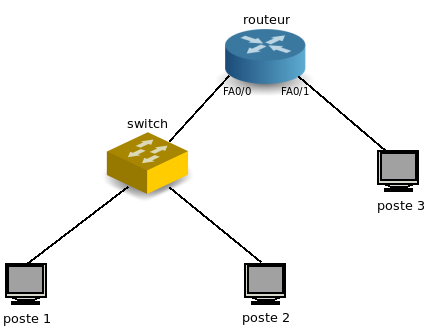

# Rapport pour le TP4 : Liaison de données

Ce dépôt appartient à Hichem **KARFA** et Benedictus Kent **Rachmat**, Groupe 7 du S5 Licence 3 Informatique.

## Adressage

1. Sur votre machine, quel est le nom de l’interface connectée au réseau de la salle de TP ? Quelle est son
   adresse IPv4 ? Quelle est son adresse IPv6 ? Quelle est son adresse MAC ?

   Pour connaitre toutes ces informations, on peut utiliser la commande `ip address`. <br/>
   Voici les informations que nous pouvons en tirer :<br/>
   Nom de l’interface : eth2<br/>
   IPv4 (inet) : 192.168.5.60<br/>
   IPv6 (inet6) : fe80::e654:e8ff:fe59:7b6a<br/>
   Adresse MAC (link/ether) : e4:54:e8:59:7b:6a<br/>

2. Donnez les principales caractéristiques de cette interface : quelle est sa vitesse actuelle ? Est-ce la vitesse
   maximale supportée par l’interface ? Quel le mode de duplex ? Vérifiez que l’interface est bien
   connectée.

   Nous pouvons utiliser la commande `sudo ethtool eth2` pour récupérer ces informations :<br/>
   Vitesse actuelle (speed) : 100Mb/s<br/>
   Vitesse maximale supportée : 1000baseT/Full<br/>
   Duplex : Full<br/>
   L'interface est bien connectée : Link detected: yes<br/>

3. Quelle est la classe de l’adresse IPv4 ? Quel est son masque ? Quelle est l’adresse du réseau au format
   CIDR ? Quelle est l’adresse de broadcast ? Combien d’hôtes peut-on adresser sur ce réseau ? Cette
   adresse est-elle routable au sein d’un réseau local ? Est-elle routable sur internet ?

   Classe : Classe C car le premier octet est entre 192 et 223<br/>
   Masque : `ip address` -> 255.255.255.0<br/>
   CIDR : `ip address` -> 192.168.5.60/24<br/>
   Broadcast : `ip address` -> 192.168.5.255<br/><br/>
   Hôtes : 2<sup>(32-24)</sup>-2 = 254 -> Ce réseau peut adresser 254 hôtes.<br/>
   Cette adresse est routable au sein d'un réseau local mais pas sur internet.<br/>

4. Écrivez les 16 octets de l’adresse IPv6 sans abréviation. Écrivez en dessous les 16 octets du masque. Combien d’hôtes peut-on adresser sur ce réseau ? Cette adresse est-elle routable au sein d’un réseau local ? Est-elle routable sur internet ? Quelle est l’étendue (scope) de cette adresse ?

   IPv6 : fe80:0000:0000:0000:e654:e8ff:fe59:7b6a<br/>
   Les 16 octets du masque : ffff:ffff:ffff:ffff:0000:0000:0000:0000<br/>
   Hôtes : 2<sup>(128-64)</sup>-1 = 1.8 x 10<sup>19</sup> -> Ce réseau peut adresser 1.8 x 10<sup>19</sup> hôtes.<br/>
   Cette adresse n'est pas routable au sein d'un réseau local et n'est pas routable sur internet.<br/>
   Scope : Il s'agit d'un Lien-local car le prefixe de notre adresse IPv6 est fe80::/64.<br/>

   Affichez la table de routage. Quelle est l’adresse de la passerelle IP ?

   On affiche la table de routage avec la commande `route -n` :<br/>
   L'adresse de la passerelle IP est 192.168.5.1

5. Avec Wireshark, lancez une capture de trames sur l’interface connectée au réseau de la salle de TP.
   Testez la connectivité IPv4 et IPv6 avec votre voisin.

   Pour tester la connectivité avec notre voisin, on peut utiliser la commande `ping` :<br/>
   IPv4 : `ping 192.168.5.61`<br/>
   IPv6 : `ping6 -I eth2 fe80::e654:e8ff:fe59:7767`<br/>

6. Arrêtez la capture. La transmission qui nous intéresse est noyée parmi d’autres trames qui nous
   parasitent.
   Pour simplifier la lecture, filtrez la capture de manière à ce que soient affichées uniquement les trames
   émises par votre machine ou à destination de votre machine. Attention : les trames ethernet ne
   contiennent pas toujours un paquet IP.
   Pour savoir comment utiliser les filtres d’affichage, référez-vous à l’aide de Wireshark :
   [https://www.wireshark.org/docs/wsug_html_chunked/ChWorkDisplayFilterSection.html](https://www.wireshark.org/docs/wsug_html_chunked/ChWorkDisplayFilterSection.html)

   Pour l'IPv4 on filtre avec `ip.addr == 192.168.5.61`<br/>
   Pour l'IPv6 on filtre avec `ipv6.addr == fe80::e654:e8ff:fe59:7767`<br/>

   Voici les deux captures sur wireshark :

   IPv4 :

   

   IPv6 :

   

7. Quel est le protocole utilisé pour tester la connectivité IP ? Ce protocole est le couteau suisse d’IP. Il ne
   sert pas seulement à tester la connectivité IP. Quel est le type et le code des messages de requête et de
   réponse ?

   On utilise le protocole ICMP pour tester la connectivité IP pour l'IPv4 et ICMPv6 pour l'IPv6

   | requête                       | Type                                                   | Code   |
   | ----------------------------- | ------------------------------------------------------ | ------ |
   | Envoi de la requête (request) | type 8 : Demande d'echo                                | code 0 |
   | Reponse de la requête(reply)  | type 0 : Réponse d'echo (Réponse au message de type 8) | code 0 |

8. La plupart des protocoles réseau permettent, dans l’entête, de spécifier quel est le type du contenu
   véhiculé.
   Donnez le code du contenu de la trame ethernet.
   Donnez le code du contenu du paquet IP.

   En analysant la requête avec Wireshark nous pouvons constater que :
   Le code du contenu de la trame Ethernet est (0x0800) ce qui signifie qu'on utilise de l'IPv4. <br/>
   Le code du contenu du paquet IP est 1 c'est le code du protocole ICMP. <br/>
   On peut donc voir que les couches inférieures contiennent le code du protocole de la couche supérieur, cela peut être utile en cas de décapsulation de la trame IP en lui disant qu'elle sera le protocole utilisé pour les couches supérieures.

9. Avant l’envoi du ping IPv4, un échange de messages ARP (Address Resolution Protocol) a eu lieu. Quelle
   est l’adresse matérielle de destination de la requête ? Que signifie cette adresse ? Quelle est la question
   posée par la requête ?

   L’ARP est un protocole utilisé pour traduire une adresse IPv4 en une adresse MAC.<br/>
   l’adresse matérielle de destination de la requête est 00:00:00:00:00:00<br/>
   cette adresse signifie qu'on ne connaît pas l'adresse MAC de destination et cette adresse sera remplacée quand l'émetteur connaîtra l'adresse MAC de destination<br/>
   voici la question posé : who has `<ip address dest>`? tell `<ip address source>` (Qui a l'addresse `<ip adress dst>` dite le moi à l'addresse `<ip address source>`)<br/>

10. Avant l’envoi du ping IPv6, un échange de messages ICMPv6 de type Neighbor Solicitation et Neighbor Advertisement a eu lieu. Quelle est l’adresse matérielle de destination de la requête ? Que signifie cette adresse ? Quelle est l’adresse IP de destination de la requête ? A quoi correspond cette adresse ?

    Neighbor Solicitation : Les messages ICMPv6 de ce type peuvent soit transmettre des dispositifs via multicast s’ils veulent déterminer une adresse, soit via unicast s’ils ne font que vérifier la disponibilité d’un voisin.<br/>
    Pour la Solicitation l'adresse destination est e4:54:e8:59:7b:6a<br/>
    Pour la Solicitation l'adresse IP destination est fe80::e654:e8ff:fe59:7b6a<br/>

    Neighbor Advertisement : Utilisé à la fois en réponse à des Neighbord Solicitation, mais aussi de manière non sollicité pour informer d’autres participants sur les changements dans la configuration de l’adresse.<br/>
    Pour la Solicitation l'adresse destination est e4:54:e8:59:77:67<br/>
    Pour la Solicitation l'adresse IP destination est fe80::e654:e8ff:fe59:7767<br/>

11. Affichez la liste des correspondances entre adresses IP et adresses ethernet. Vérifiez que l’adresse IPv4 et l’adresse IPv6 de votre voisin y figurent, associées à son adresse MAC. Attention : les entrées de ce cache ont une durée de vie limitée à quelques minutes.

    Pour afficher la liste des correspondances entre adresses IP et adresses ethernet, on utilise la commande `arp -a`.<br/>

    

    On peut voir à la dernière ligne que notre voisin y figure.

12. A quelles couches du modèle OSI appartiennent les protocoles ethernet, IP, ICMP ?

    Ethernet : Couches liaison de données. (OSI 2)<br/>
    IP : Couche réseau. (OSI 3)<br/>
    ICMP : Couche réseau. (OSI 3)

13. Selon vous, de manière générale, pourquoi utilise-t-on l'adresse IP et non uniquement l'adresse MAC pour
    les communications réseaux ?

    L'adresse MAC est fournie par le fabricant de l'appareil et non pas par le fournisseur internet. l'adressse MAC n'as pas de structure hiérarchique permettant au routeur d'aiguiller les paquets contrairement au adresse ip<br/>
    C'est pourquoi on utilise l'adresse IP pour les communications dans un réseau.<br/>

## Point-à-point

Chaque machine de la salle dispose d’au moins 2 interfaces ethernet. Laissez votre machine connectée à la prise EXT, qui vous permet d’atteindre internet ou votre homedir. Utilisez une autre interface ethernet pour la connecter à la machine de votre voisin, en point-à-point, via la
baie de brassage.

1.  Vous utilisez un câble droit ou un câble croisé ?

    On utilise un câble croisé car les deux machines sont aux mêmes niveaux.

2.  Quelle commande utilisez-vous pour vérifier que votre interface est bien connectée, et connaître la vitesse et le mode de duplex qui ont été négociés entre vos deux machines ?

    Pour connaître la vitesse et le mode duplex négocié entre les machines on utilise la commande `sudo ethtool {nom de l'interface connectée}`. dans notre cas l'interface eth0 est connectée en point à point donc : <br/>

    ```bash
    $ > sudo ethtool eth0
    ```

    On voit que la vitesse est à 1000Mb/s et que le mode de duplex est le full duplex.<br/>

3.  Affectez une adresse IPv4 privée de classe A à l’interface ethernet. Notez qu’une adresse IPv6 est déjà associée à cette interface. Elle a été configurée automatiquement.

    Vous remarquerez qu’une même interface réseau peut très bien être associée à plusieurs adresses IP.

    Pour affecter une adresse IPv4 de classe A à l'interface ethernet, <br/>
    On utilise la commande suivante : `sudo ip addr add 10.1.2.4/8 dev eth0` <br/>
    Nous utiliserons l'ip `10.1.2.4/8` pour notre machine et `10.1.2.3/8` pour la machine de mon voisin.

4.  Affichez la table de routage. Que constatez-vous ?

    On utilise la commande `route` et nous pouvons voir qu'une nouvelle interface a été configurée et ajoutée au table de routage.

    

5.  Testez la connectivité avec votre voisin.

    Pour tester la connectivité on utilise la commande ping avec l'adresse IPv4 de notre voisin : `ping xx.xx.xx.xx` <br/> où `xx.xx.xx.xx` est l'adresse IP configurée par la commande `sudo ip addr add x.x.x.x/y dev {nom de l'interface connectée} de notre voisin`.<br/>
    `ping 10.1.2.3`

    

## Concentrateur (hub)

Brassez votre poste de travail sur le concentrateur (hub) situé dans la baie de brassage.
Assurez-vous que deux de vos voisins y sont connectés également.
Supprimez les filtres de capture et d'affichage préalablement configurés.

1.  Lancez une capture de trames sur un poste, et transmettez un ping entre les deux autres postes. Que
    constatez-vous ? Déduisez-en la manière dont les données sont transmises par cet équipement. Les
    données émises par un poste sont-elles reçues par ce même poste ?

    On constate dans wireshark que lorsqu’on transmet un ping entre les deux autres postes, toutes les autres machines connectés au concentrateur (hub) reçoivent le ping transmis.
    On peut en déduire que le hub renvoie les messages à l'ensemble des machines connectées au hub. Les messages sont ignorés par les machines non concernées.
    Les données émises par un poste ne sont pas reçues par ce même poste.

2.  Recommencez la manipulation en désactivant le mode promiscuous de wireshark. A quoi sert-il ?

    Pour désactiver le mode promiscuous, appuyez sur le bouton `option` et décochez l'option promiscuous.<br/>
    On peut voir sur wireshark qu'on ne reçoit plus les paquets qui nous n'est pas directement destinée
    le mode promiscuous est une technique de sécurité, de surveillance et d'administration réseau qui permet d'accéder à des paquets de données réseau entiers par n'importe quelle carte réseau configurée sur un système hôte. Le mode promiscuous est utilisé pour surveiller (sniff) le trafic réseau.

3.  Quel est le mode de duplex des interfaces connectées au hub ? Quelle en est la signification ?

    Depuis la commande `sudo ethtool {nom de l'interface connectée}` le mode de duplex des interfaces connectées au hub sont en HALF,
    Cela signifie que deux machines ne peuvent pas communiquer en même temps. C'est le fonctionnement à l'alternat comme le talkie walkie: celui qui veut parler attend que l'autre ait fini avant de le faire et les deux interlocuteurs ne peuvent émettre et recevoir en même temps.

4.  Quelles sont les topologies physique et logique du réseau constitué par le concentrateur et les postes qui y
    sont connectés ?

    Topologies physique : étoile <br/>
    Topologies logique : bus

5.  Lancez la commande « iperf -s » sur un poste et « iperf -c ip_du_serveur » sur un autre poste pour lancer
    un test de bande passante. Notez le débit atteint et les valeurs du compteur de collisions (voir annexe)
    avant et après la manipulation.
    Connectez un poste supplémentaire sur le hub (soit au minimum 4 postes) et réalisez de nouveau la manip
    en parallèle sur les deux paires de postes.
    Notez le débit atteint et les nouvelles valeurs des compteurs de collisions. Déduisez-en la manière dont
    fonctionne un hub.

    Avec la commande `ip -0 link afstats dev eth0`

    Avant la manipulation avec un 3ème poste, on obtient `8.56Mbits/s` pour la bande passante, et `10.9Mbytes` en transfert.

    En essayant la manipulation en connectant un poste supplémentaire, on peut réaliser 2 tests de bande passante en même temps. On remarque que la bande passante est à peu près divisée par 2 et le compteur de collisions augmente.
    Les postes connectés entre eux via des concentrateurs forment un domaine de collision.

## Commutateur (switch)

Brassez votre poste de travail sur le commutateur (switch) situé dans la baie de brassage.
Assurez-vous que deux de vos voisins y sont connectés également.
Supprimez les filtres de capture et d'affichage préalablement configurés.
Réactivez le mode promiscuous.

1.  Lancez une capture de trames sur un poste, et transmettez un ping entre les deux autres postes. Que
    constatez-vous ? Déduisez-en la manière dont les données sont transmises par cet équipement.

    On constate dans wireshark que lorsqu’on transmet un ping entre les deux autres postes, seulement le poste désigné (qui est connecté au même commutateur) reçoit le ping transmis.<br/>

    On peut donc en déduire que le switch transmet les données uniquement aux bons destinataires contrairement au hub.

    

2.  Quel est le mode de duplex des interfaces connectées au hub ? Quelle en est la signification ?

    Depuis la commande `sudo ethtool eth0` le mode de duplex des interfaces connectées au hub sont en FULL,
    Cela signifie plusieurs machines peuvent communiquer en même temps.

3.  Quelles sont les topologies physique et logique du réseau constitué par le commutateur et les postes qui y
    sont connectés ?

    Topologies physique : étoile <br/>
    Topologies logique : étoile

4.  Lancez la commande « iperf -s » sur un poste et « iperf -c ip_du_serveur » sur un autre poste pour lancer
    un test de bande passante. Notez le débit atteint et les valeurs du compteur de collisions (voir annexe)
    avant et après la manipulation.
    Connectez un poste supplémentaire sur le switch (soit au minimum 4 postes) et réalisez de nouveau la
    manip en parallèle sur les deux paires de postes.
    Notez le débit atteint et les nouvelles valeurs des compteurs de collisions. Déduisez-en la manière dont
    fonctionne un switch.

    Le débit atteint pour la bande passante est de `94.2Mbits/sec` et le transfert est de 112 Mbytes.
    En essayant la manipulation en connectant deux postes supplémentaires, on peut réaliser deux tests de bande passante en même temps. On remarque que la bande passante reste la même.
    Cela signifie que le fait que plusieurs machines communiquant entre elles en même temps n'a pas d’impact sur le débit.

    Pour paramétrer les équipements réseau et obtenir des informations sur leur configuration, il faut établir une liaison série entre votre poste de travail et le port console de l'équipement en question.
    Cette liaison permet d'établir une connexion dite « hors bande », c'est-à-dire en dehors de la bande passante
    du réseau ethernet.
    Connectez-vous sur le port console d'un switch, noté Sx-C (avec x=R,J,B ou V selon votre baie de brassage).
    Utilisez pour cela un câble série DB9-RJ45 (câble bleu et plat) et lancez le programme « minicom ».<br/>

    Une fois connecté, tapez sur la touche « entrée » pour afficher le prompt. Si la question « voulez-vous lancer le setup du switch ? » vous est posée, répondez « non ».
    Vous êtes actuellement en mode USER EXEC (prompt >), qui ne permet de lancer qu'un nombre réduit de
    commandes, que vous pouvez lister en tapant « ? ». Passez en mode privilégié (prompt #), puis affichez la
    table de commutation.

5.  Comparez les adresses MAC listées avec celles de vos postes et les ports du switch sur lesquels ils sont
    connectés. Comment le switch a-t-il obtenu ces adresses ? Quel est le rôle de la table de commutation
    (appelée aussi table d'adresses MAC) ?

    Les adresses MAC listées correspondent à celles de nos postes, en listant les ports dans minicom on voit qu’ils correspondent au ports utilisés sur le switch.

    Le switch a obtenu ces adresses après la première communication de chaque machine après la connexion au switch.
    Le rôle de la table de commutation est d’associer les adresses MAC aux ports qu’elles utilisent.

6.  Pour fonctionner correctement, le switch a-t-il besoin de connaître les adresses mac des trames ? les
    adresses IP des paquets ? Déduisez-en à quels niveaux du modèle OSI interviennent un switch et un hub
    et quelles sont les unités de données sur lesquelles ils agissent.

    Un commutateur (couche 2 modèle d'OSI) n'a pas besoin d'une adresse IP pour transmettre des trames aux ordinateurs connectés.<br/>

    Néanmois, il a besoin de l'adresse MAC pour communiquer entre les ordinateurs.

7.  Concluez sur les avantages du switch par rapport au hub.

    L'un des avantage d'un commutateur par rapport à un concentrateur est la façon dont la bande passante. Comme on peut le voir avec la commande `ipref` on peut voir que la bande passante est `94.5 Mbits/sec` ce qui est plus rapide que le hub. <br/>  
    l'autre avantage est que le mode duplex entre un concentrateur et un commutateur varie également. Un hub fonctionne en half-duplex, ce qui signifie qu'il ne peut pas envoyer et recevoir de données en même temps. Une opération doit être terminée avant que l'autre puisse commencer. mais les commutateurs fonctionnent en full-duplex et peuvent envoyer et recevoir exactement en même temps.
    Le switch permet donc d'offrir une meilleure sécurité et une meilleure performance que le hub.

8.  Selon vous, en fonctionnement normal, une interface d’un commutateur peut-elle être associée au même
    moment à plusieurs addresses ethernet ? Une même adresse ethernet peut-elle être associée au même
    moment à plusieurs interfaces d’un commutateur ?

    Un commutateur peut avoir plusieurs adresses MAC associées à un seul port (le commutateur est connecté à un autre commutateur par exemple). Le commutateur aura une entrée de table d'adresses MAC distincte pour chaque trame reçue avec une adresse MAC source différente. Une même adresse ne peut par contre pas être associée à plusieurs interfaces.

9.  Lancez maintenant une capture de trames sur plusieurs postes connectés au switch et transmettez un ping
    vers l'adresse IP 255.255.255.255. Que constatez-vous ? Comment s'appelle ce type de transfert ? Quelle
    est l'adresse ethernet de destination des trames reçues ?

    ```bash
    $ > ping -I eth0 -b 255.255.255.255
    ```

    on peut constater que toutes les postes connectées au switch on reçu le ping,
    ce type de transfert s'appelle de le broadcast

10. Envoyez un ping vers l’adresse ff02::1. Que constatez-vous ? Comment s'appelle ce type de transfert ?
    Quelle est l'adresse ethernet de destination des trames reçues ?

    Nous constatons que nos voisins ont reçu le ping. et nous renvoyons une réponse.

    Ce type de transfert s'appelle le multicast,

    l'adresse de destination des trames reçues est `33:33:00:00:00:01`

    

    Un commutateur permet de segmenter les domaines de collisions.

    Les postes connectés par l'intermédiaire de commutateurs constituent un **domaine de broadcast**.

## Routeur

Choisissez 2 sous-réseaux IPv4 de classe B. Veillez à ce qu’ils soient différents de votre voisin.
Complétez le schéma suivant en affectant une adresse IP aux interfaces, l’objectif étant que les postes
puissent communiquer ensemble.



Connectez 3 postes, 1 switch et 1 routeur en suivant ce schéma.

1.  Configurez les adresses IP sur les interfaces en vous référant à l’annexe.

    Voici les trois adresses IP que nous avons choisi : 

    ip address add   131.0.0.2/24 dev (nom de l'interface) <br/>
    ip address add   131.0.0.3/24 dev (nom de l'interface) <br/>
    ip address add   130.0.0.5/24 dev (nom de l'interface) <br/>

    Voici la configuration du routeur pour les deux sous-réseaux 

    

2.  Ajoutez une route sur les postes de manière à ce que les postes 1 et 2 puissent communiquer avec le 3.

        ip route add 131.0.0.0/24 via 130.0.0.1/24 dev (nom de l'interface)<br/>
        ip route add 130.0.0.0/24 via 130.0.0.1/24 dev (nom de l'interface)<br/>

3.  Après avoir lancé une capture de trames sur les postes 2 et 3, lancez un ping depuis le poste 1 vers le
    poste 2, puis vers le poste 3 (voir schéma). Il s'agit d'un transfert unicast. Comparez les valeurs du champ
    TTL (Time to live) de l'entête IP des paquets reçus sur les postes 2 et 3. Pourquoi sont-elles différentes ? Quelle est
    l'utilité de ce champ ?

    Sur cette image ci dessous nous pouvons voir que le TTL entre le poste 1 et 2 et de 64 alors que celui entre le poste 1 et 3 et de 63. le TTL (time To live) représente un compteur qui décrémente de 1 à chaque fois que le paquet passe par un routeur, une fois qu'il est à 0 le routeur le jette et les PC ignorent les paquets ayant un TTL de 0.<br/>

    Voici le screenshot d'une capture d'écran de wireshark lors de l'envoie du ping entre le poste 1(131.0.0.2) et 3(130.0.0.5)  et entre le poste 1 et 2(131.0.0.3).


4.  Quelle devrait être la valeur du TTL pour que le poste 1 puisse communiquer avec le poste 2, mais pas
    avec le poste 3 ? Vérifiez votre réponse en envoyant, depuis le poste 1, un ping avec ce TTL vers les
    postes 2 et 3 (voir « man ping »).
    Lancez une capture sur le poste 1 et envoyez un ping du poste 1 vers le poste 3 en conservant le TTL que
    vous avez choisi. Que se passe-t-il ?

    Pour que le poste 1 puisse communiquer avec le poste 2, mais pas avec le poste 3 La valeur du TTL devrait être 1. En faisant une commande ping nous avons pu appercevoir que le poste 2 recevais le messages mais pas le 3.

5.  Lancez de nouveau un ping depuis le poste 1 vers le poste 3. Quelles sont l'adresse MAC source de la
    trame reçue (sur le poste 3) et l'adresse MAC de destination de la trame envoyée (à partir du poste 1) ?
    Selon vous, à quelles interfaces ethernet correspondent ces adresses ? Pour vous aider, lancez la
    commande « show interface fastethernet » sur le routeur.

    L'adresse MAC source de la trame reçue est celle de l'interface du routeur. L'adresse MAC de destination de la trame envoyée est celle de l'interface du routeur.

6.  Comment le poste 1 a-t-il sur que la trame ethernet contenant le paquet IP à destination du poste 3 devait
    être envoyée au routeur ?

    Grâce à sa table de routage ainsi qu'au protocole ARP.

7.  Dessinez un schéma des couches OSI utilisées dans chaque équipement mis en jeu dans le transfert
    unicast (2 postes, 1 switch et 1 routeur), et tracez une ligne représentant le flux de données passant d'un
    équipement à l'autre (communication horizontale) en traversant les couches (communication verticale).

    

8.  Lancez une capture de trames sur les 3 postes et lancez un ping depuis le poste 1 vers l'adresse
    255.255.255.255. Il s'agit d'un transfert en diffusion limitée (broadcast). Que constatez-vous ?

    Toutes les machines du même sous-reseaux recoivent le messages, pas celles d'un autre sous-reseaux . Ce qui veut dire que le broadcast ne traverse pas le routeur.

9.  Lancez une capture de trames sur les 3 postes et lancez un ping depuis le poste 3 vers l'adresse de
    broadcast du réseau sur lequel se trouvent les postes 1 et 2. Que constatez-vous ?

    Aucune machine ne reçoit le paquet.

        Exécutez les commandes suivantes sur le routeur :
        _Router(config)#interface fastEthernet 0/0_
        _Router(config-if)#ip directed-broadcast_

10. Recommencez la manipulation précédente. Il s'agit d'un transfert en diffusion dirigée. Que constatez-
    vous ? Quelle est l'adresse IP de destination des paquets reçus ? Selon vous, pourquoi ce mode de
    transfert est-il désactivé par défaut ?

    Il transforme l'adresse 255.255.255.255 en adresse de diffusion. Ce type de transfert doit être désactivé par sécurité.

11. Quelle est la différence entre diffusion limitée, diffusion dirigée et unicast.

    - diffusion limitée : Un paquet est envoyé à un réseau spécifique ou à une série de réseaux. Une adresse de diffusion limitée inclut les champs réseau ou sous-réseau.
    - diffusion dirigée : Un paquet est envoyé à une adresse de destination spécifique où seule la partie hôte de l'adresse IP est soit entièrement composée de uns / zéros
    - unicast : Un paquet n'est envoyé qu'à une seule station du réseau.<br/><br/>

12. Comment un routeur réagit à ces différents types de paquets ? Concluez sur la différence entre un routeur
    et un switch vis-à-vis de la diffusion IP.

    Lorsqu'un paquet de données arrive, le routeur lit les informations d'adresse réseau dans l'en-tête du paquet pour déterminer la destination finale.<br/>

    - Router : Chaque port a son propre domaine de diffusion, le routeur utilise l'adresse IP

    - Switch : Le switch a un domaine de diffusion à l'exception du VLAN (virtual LAN) mis en œuvre, le switch utilise l'adresse MAC

13. Reliez votre routeur à celui de votre voisin de manière à ce que touts les machines puissent communiquer
    ensemble.
