# Rapport pour le TP2 : Routage

Ce travail est à réalisé par BENEDICTUS KENT **RACHMAT** (**Groupe 1 du S6 Licence 3 Informatique**)

Voici une visualisation simple du lien entre le routeur, le réseau et les adresses IP.

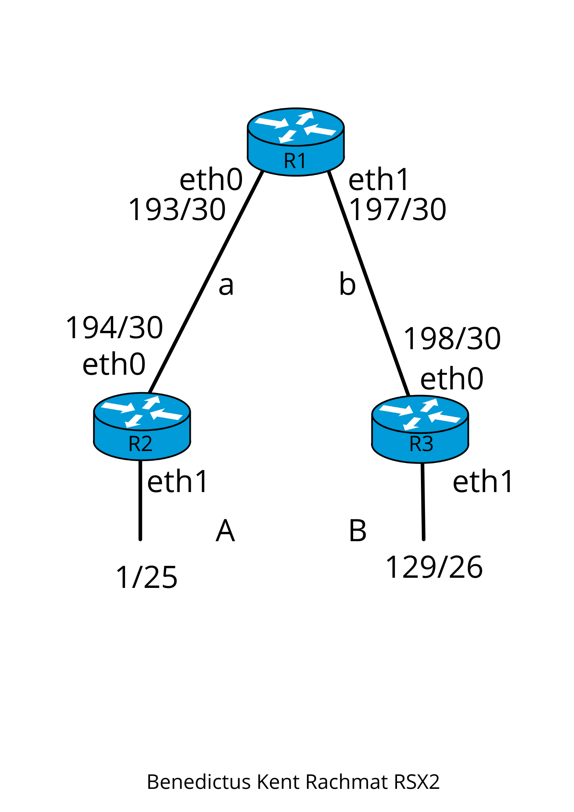

Toutes les captures d'écran sont dans le dossier `img` avec le nom des exercices comme sous-dossier, et la capture wireshark est dans le dossier `wireshark`.

# 1. Routage statique

Capture d'ecran : `img/routage`

Chaque commande lance un routeur et une console qui vous permet de configurer le routeur.

```bash
$ vstart -D R1 --eth0=a --eth1=b
$ vstart -D R2 --eth0=a --eth1=A
$ vstart -D R3 --eth0=b --eth1=B
```

ou vous pouvez simplement utiliser cette commande :

```bash
$ ./router.sh
```

Voici à quoi doit ressembler votre écran :

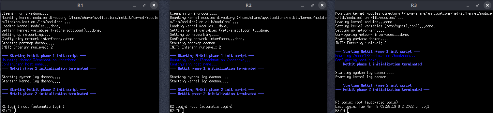

### 1) Affichez la table de routage des routeurs. Que constatez-vous ?

En utilisant la commande `ip route` on peut voir que notre table de routage est vide parce que je n'ai pas encore configuré chacun d'entre eux.

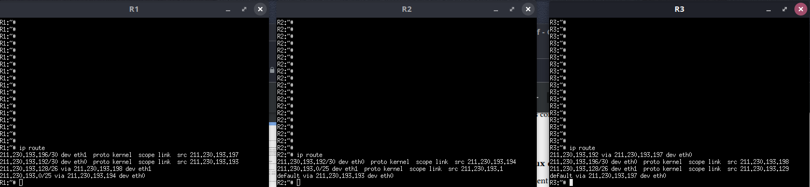

### 2) Configurez et activez les interfaces des routeurs en vous basant sur l’adressage IPv4 vu en TD. Comment vérifier que la configuration IP est correcte ?

Avant de configurer chaque routeur, nous devons activer les interfaces en utilisant cette commande `ip link set dev <interface> up`. Et pour configurer, utilisez cette commande :

```bash
R1:# ip addr add dev eth0 211.230.193.193/30
R1:# ip addr add dev eth1 211.230.193.197/30

R2:# ip addr add dev eth0 211.230.193.194/30
R2:# ip addr add dev eth1 211.230.193.1/25

R3:# ip addr add dev eth0 211.230.193.198/30
R3:# ip addr add dev eth1 211.230.193.129/26
```

Après la configuration, nous pouvons utiliser la commande `ip route` pour vérifier si l'IP est correcte ou non.

### 3) Affichez la table de routage des routeurs. Pourquoi les tables de routage ne sont-elles pas vides ? Quelle est la particularité des routes déjà présentes ? Que signifie « scope link » ?

En utilisant la commande `ip route`, nous pouvons voir que la table de routage n'est pas vide maintenant car j'ai déjà configuré chaque routeur.

scope link signifie qu'à l'intérieur du segment de réseau du périphérique, la communication est autorisée par ce lien.


### 4) Configurez les tables de routage de manière à ce que les 3 routeurs puissent envoyer des données (ping) vers les 4 réseaux a, b, A et B.

Pour configurer la table du routeur afin que ces 3 routeurs puissent envoyer un message ping vers 4 réseaux **a, b, A et B** je dois utiliser cette commande dans chaque terminal du routeur

```bash
R1:# ip route add 211.230.193.0/25 dev eth0 via 211.230.193.194
R1:# ip route add 211.230.193.128/26 dev eth1 via 211.230.193.198

R2:# ip route add 0.0.0.0/0 dev eth0 via 211.230.193.193

R3:# ip route add 211.230.193.192/30 dev eth0 via 211.230.193.197
ou
R3:# ip route add 0.0.0.0/0 dev eth0 via 211.230.193.197
```

Voici quelques captures lorsque vous envoyez un ping vers un certain réseau, d'autres images peuvent être trouvées dans le dossier `img/routage` avec le format `ping ({routeur} - {résaux}).png`

|                 R1-A                 |                  R2-a                   | R3-a                                    |
| :----------------------------------: | :-------------------------------------: | --------------------------------------- |
|  |  |  |

# 2. Traceroute

Capture d'ecran : `img/traceroute`

Capture wireshark : `img/traceroute`

Avant de commencer l'exercice, nous devons faire une capture de trames sur l'interface eth0 de R1 et une capture de trames sur l'interface eth1 de R1 en exécutant les 4 commandes suivantes :

```bash
- sur R1 :
R1:~# tcpdump -Uni eth0 -w /hosthome/R1_eth0.cap &
R1:~# tcpdump -Uni eth1 -w /hosthome/R1_eth1.cap &

- sur la machine physique (par exemple a13p16) :
a13p16> tail -n+0 -f ~/R1_eth0.cap | wireshark -SHkli - &
a13p16> tail -n+0 -f ~/R1_eth1.cap | wireshark -SHkli - &
ou
a13p16> ./wireshark.sh
```

2 fenêtres de Wireshark s'affichent.

### 1. Sur R2, utilisez la commande « traceroute -I icmp -q 1 » vers le réseau B, en mettant comme paramètre l’adresse IP associée à l’interface eth1 de R3.

```bash
R2:# traceroute -I icmp -q 1 211.230.193.129
traceroute to 211.230.193.129 (211.230.193.129), 64 hops max, 28 byte packets
 1  211.230.193.193 (211.230.193.193)  4 ms
 2  211.230.193.129 (211.230.193.129)  7 ms
```

l'option **-I** permet d'utiliser ICMP ECHO au lieu de datagrammes UDP et l'option **-q** permet de définir le nombre de sondes par TTL à nqueries (par défaut, trois sondes).

### 2. Que renvoie cette commande ?

Il nous montre les adresses IP de destination ou de passerelle, par exemple dans la question précédente nous pouvons voir que notre paquet voyage à travers **R1** en utilisant son interface **eth0** avant d'atteindre la destination qui est **211.230.193.129**.

### 3. A quelles interfaces et quels routeurs correspondent ces adresses ?

- 211.230.193.193 (211.230.193.193) : coorrespond à l'interface **eth0** de routeur **R1**
- 211.230.193.129 (211.230.193.129) : coorrespond à l'interface **eth1** de routeur **R3**

### 4. Quel est le TTL du premier paquet IP envoyé par R2 ?

Dans la capture wireshark on peut voir que le TTL du premier paquet envoyé par **R2** est 1, donc quand le paquet arrive à **R1** qui est le premier arrêt, **R1** va rejetter le paquet et envoie un message (Time-to-live exceed) à **R2** parce que le TTL est maintenant 0. maintenant **R2** va envoyer un paquet avec un TTL de 2 et l'étape va se répéter comme ceci avec l'incrémentation du TTL jusqu'à ce que le paquet arrive à la destination.

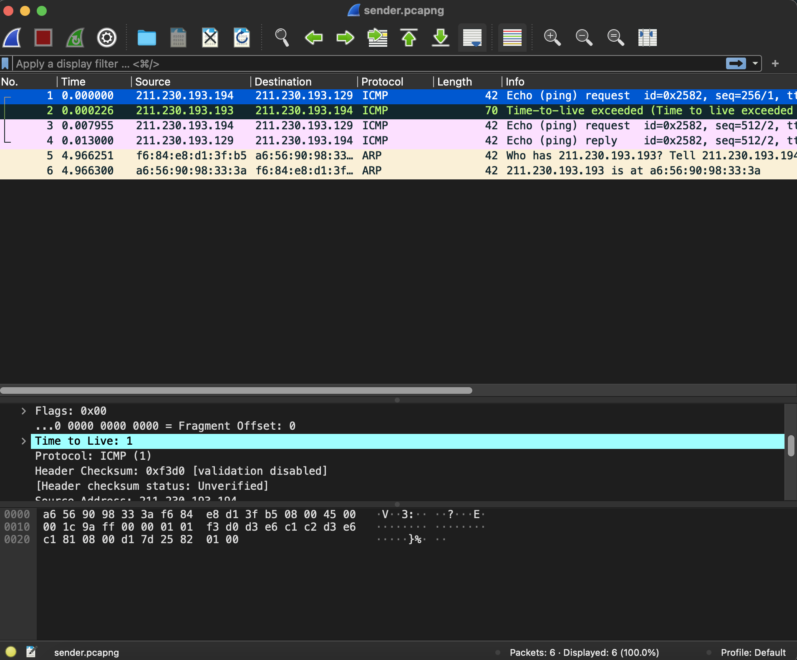

### 5. Que transporte ce paquet ?

Le paquet utilise le protocole ICMP, et il contient l'adresse de la source et de la destination et le TTL.

- **IP source** : 211.230.193.194 (R2 | eth0)
- **IP destination** : 211.230.193.129 (R3 | eth1)
- **TTL** : 1 (le paquet ne peut atteindre que R1)

### 6. Ce paquet parvient-il jusqu’à sa destination ? Pourquoi ?

non, le paquet sera détruit dans **R1** car la valeur TTL initiale est de 1. **R1** va rejetter le paquet et envoie un message (Time-to-live exceed) à **R2** parce que le TTL est maintenant 0. Maintenant **R2** va envoyer un paquet avec un TTL incrémenté (valeur : 2). à chaque fois qu'il passe par un routeur, le TTL sera décrémenté de 1. Si le TTL est de 0 et qu'il ne s'agit pas de l'IP de destination, l'étape se répétera.

### 7. Qui répond à ce paquet ? Par quel type de message (protocole, type, code) ? Quelle est la signification de la réponse ?

**R1** a répondu au paquet avec un message utilisant le protocole ICMP de type 11 (Time-to-live exceed) et code 0 (Time-to-live exceed in transit). La réponse signifie que le paquet a été reçu et qu'il a été détruit.

### 8. Quel est le TTL du 2ème paquet IP envoyé par R2 ?

Le second paquet a une valeur TTL de 2.

### 9. Ce paquet parvient-il jusqu’à sa destination ? Pourquoi ?

Oui le paquet atteint sa destination (**R3**) car nous avons assez de TTL pour atteindre la destination. nous pouvons également voir que le paquet a été reçu en utilisant la capture wireshark (l'autre côté).

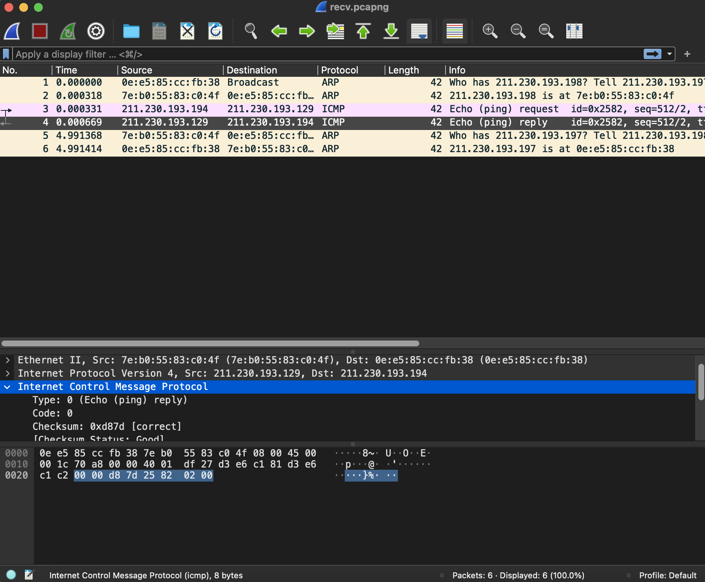

### 10. Qui répond à ce paquet ? Par quel type de message (protocole, type, code) ? Quelle est la signification de la réponse ?

**R3** a répondu à ce paquet, dans la capture wireshark on peut voir que la source IP est **211.230.193.129** qui est l'interface **eth1** de routeur **R3**. Le message utilise le protocole ICMP avec le type 0 (Echo (ping) reply) et le code 0. La réponse signifie que le paquet a été reçu par la destinaire.

### 11. Dans ces échanges, quels sont les messages qui permettent à traceroute de connaître l’adresse IP des routeurs qui sont sur le chemin de la destination ?

Les messages qui permet à traceroute de connaître les adresses IP des routeurs sur le chemin utilise le protocole ARP. L'interface demande qui a l'adresse IP et puis le router répond en donnant son adresse MAC, après avoir reçu l'information **R2** peut alors envoyer le message.

### 12. Pourquoi l’adresse IP associée à l’interface eth0 de R3 n’est-elle pas renvoyée par traceroute ?

L'adresse IP associée à l'interface **eth0** du routeur **R3** n'a pas été incluse dans le traceroute car le routeur **R1** connaît déjà le chemin pour envoyer le paquet directement à l'interface **eth1** de routeur **R3**.

# 3. Tracepath

Capture d'ecran : `img/tracepath`

Capture wireshark : `img/tracepath`

### 1) Configurez un MTU de 1000 octets sur les interfaces connectées à la liaison ‘b’.

```bash
R1:# ip link set dev eth1 mtu 1000
ou
R3:# ip link set dev eth0 mtu 1000
```

### 2) Transmettez, avec ping, une requête ICMP de 1200 octets depuis R2 vers le réseau B, avec l’option ‘-M dont’ (voir annexe). Qu’affiche la commande ping ?


```bash
R2:# ping -c1 -s 1200 -M dont 211.230.193.129
PING 211.230.193.129 (211.230.193.129) 1200(1228) bytes of data.

--- 211.230.193.129 ping statistics ---
1 packets transmitted, 0 received, 100% packet loss, time 0ms
```

l'option `-M dont` est pour modifier le flag à Not set, ici nous voyons que le paquet est 100% perdu car nous avons défini le MTU à 1000 mais notre lonngeur du message est 1200.

### 3) La requête parvient-elle à destination ? Quelle est la différence entre la requête envoyée par R2 et cette même requête après avoir été transmise par R1 vers R3 ?

La requête parvient à destination mais il y a une différence dans les flags d'envoi entre `R2` `R1` et `R1` `R3`.

La requête reste en un bloc pour voyager de R2 à R1. mais la requête est fragmentée pour pouvoir atteindre R3 car la MTU n'est pas assez grande pour la faire passer en 1 bloc. (1000 < 1200)

nous pouvons voir les différents dans le fichier de capture wireshark (dans `wireshark/tracepath`): `(R1-eth0) avec -M dont.pcapng` et `(R1-eth1) avec -M dont.pcapng`

### 4) Quelle est la différence entre la réponse renvoyée par R3 et cette même réponse après avoir transmise par R1 vers R2 ?

La réponse est toujours fragmentée entre R3 et R1 et la requête à été réassemblée lors de son retour de R1 vers R2

### 5) Transmettez, avec ping, une requête ICMP de 1200 octets depuis R2 vers le réseau B, mais, cette fois-ci, sans l’option ‘-M dont’ (voir annexe). Qu’affiche la commande ping ?

```bash
R2:# ping -c1 -s 1200 211.230.193.129
PING 211.230.193.129 (211.230.193.129) 1200(1228) bytes of data.
From 211.230.193.193 icmp_seq=1 Frag needed and DF set (mtu = 1000)

--- 211.230.193.129 ping statistics ---
1 packets transmitted, 0 received, +1 errors, 100% packet loss, time 0ms
```

la commande ping nous montre une erreur et 100% du paquet est perdu.

### 6) La requête parvient-elle à destination ? Pour quelle raison ? Quelle est la valeur du flag « don’t fragment » du paquet IP contenant la requête ?

Non, car la trame est plus grande que le MTU et le bit de don't fragment est défini, il supprimera donc le paquet. La suppression du routeur renverra à l'expéditeur le message ICMP Fragmentation Needed (Type 3, Code 4) qui contient la taille MTU, puis l'expéditeur doit renvoyer ce paquet ajusté à la taille MTU qu'il a reçue dans le message ICMP.

`.1.. .... = Don't fragment: Set`

Addition :
IPv4 n'a pas besoin de bit de fragment mais il peut être défini dans la pile IP. La fragmentation entraîne une surcharge supplémentaire du processeur qui peut affecter le débit total, de sorte que la plupart du temps.

nous pouvons voir le fichier de capture wireshark (dans `wireshark/tracepath`): `(R1-eth0) sans -M dont.pcapng`

### 7) Quel avertissement R1 renvoie-t-il à R2 ?

Destination unreachable (Fragmentation needed)

type : **3 (Destination Unreachable)**

code : **4 (Fragmentation Needed)**

### 8) Exécutez sur R2 la commande tracepath vers le réseau B. Qu’affiche cette commande ?

```bash
R2:# tracepath  211.230.193.129
tracepath  211.230.193.129
1:  211.230.193.194 (211.230.193.194)                      0.205ms pmtu 1500
1:  211.230.193.193 (211.230.193.193)                      1.200ms
1:  211.230.193.193 (211.230.193.193)                      0.428ms
2:  211.230.193.193 (211.230.193.193)                      0.590ms pmtu 1000
2:  211.230.193.129 (211.230.193.129)                      0.839ms reached
    Resume: pmtu 1000 hops 2 back 63
```

les différentes liaisons employées depuis `R2` pour accéder à l'adresse de destination

### 9) Que transportent les paquets IP envoyés par R2 ?

Le package ICMP et UDP a été envoyé à partir de R2. avec un TTL initial de 1 et incrémenté pour la suite. à la fin, nous avons un avertissement Destination unreachable (Fragmentation needed) car notre flag de don't fragment dans UDP est défini.

### 10) Quelle est la valeur du flag « don’t fragment » des paquets IP envoyés par R2 ?

Le paquet contient 2 protocoles qui sont UDP et ICMP, ou le flag de don't fragment dans UDP est toujours défini c'est à dire que les paquets envoyés par R2 ne sont pas fragmentés et le flag don't fragment dans ICMP n'est toujours pas défini.

### 11) Quelles sont les différences dans l’entête IP des paquets envoyés successivement par R2 ?

Le TTL ainsi que la taille du paquet sont variants.
Les 4 premiers ont un TTL à 1 le suivant à un TTL à 2.
La taille du paquet passe de 1514 à 1014 lorsque R1 renvoie à R2. (Fragmentation Needed)

nous pouvons voir les différents dans le fichier de capture wireshark (dans `wireshark/tracepath`): `(R1-eth0) tracepath.pcapng` et `(R1-eth1) tracepath.pcapng`

### 12) Qui répond aux 2 premiers paquets ? Par quel type de message (protocole, type, code) ? Quelle est la signification de la réponse ?

notre 2 premier paquet a été répondu par le routeur **R1** et la réponse est Time-to-live exceeded (Time to live exceeded in transit), ce qui se produit parce que la valeur de TTL est 1.

protocole : **ICMP**

type : **11 (Time-to-live exceeded)**

code : **0 (Time to livve exceeded in transit)**

### 13) Les 2 premiers paquets arrivent-ils à destination ? Pourquoi ?

Non, parce que la valeur de TTL est 1 (TTL est trop court).

### 14) Qui répond au 3ème paquet ? Par quel type de message (protocole, type, code) ? Quelle est la signification de la réponse ?

C'est toujours le routeur **R1** et la réponse est destination unreachable (Fragmenntation needeed), cela s'est produit parce que le flag de don't fragment dans notre paquet UDP est défini et que la longueur du message dépasse la limite **MTU** (1514 > 1000).

protocole : **ICMP**

type : **3 (Destination unreachable)**

code : **4 (Fragmentation needed)**

### 15) Le 3ème paquet arrive-t-il à destination ? Pourquoi ?

Non parce que le flag de don't fragment dans notre paquet UDP est défini donc il est trop gros. (il doit être fragmenté pour atteindre sa destination)

### 16) Qui répond au 4ème et dernier paquet ? Par quel type de message (protocole, type, code) ? Quelle est la signification de la réponse ?

C'est l'addresse `211.230.193.129` ou routeur R3 qui répond au 4ème et dernier paquet avec un message de type ICMP

protocole : **ICMP**

type : **3 (Destination Unreachable)**

code : **3 (Port Unreachable)**

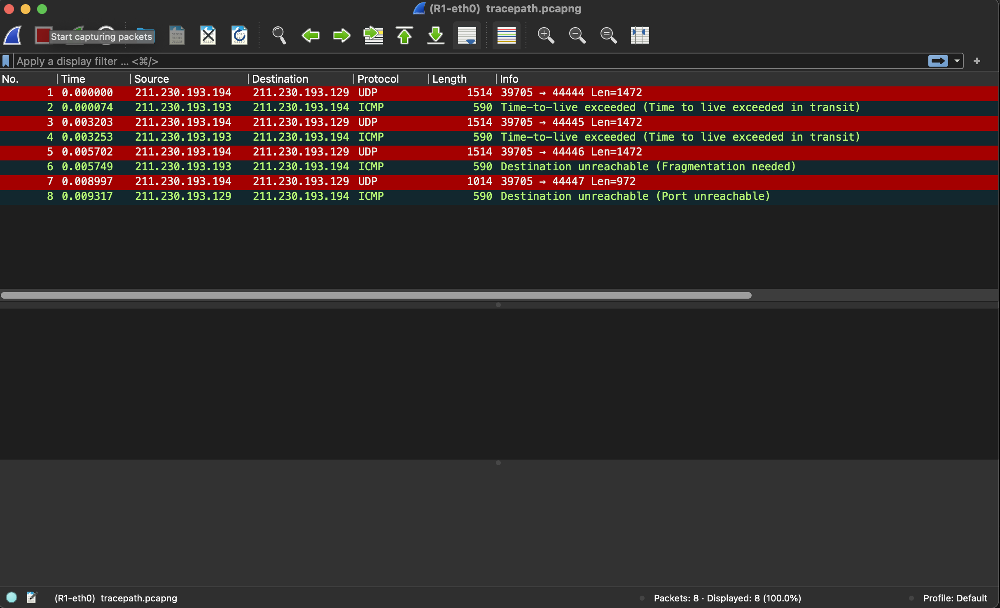

### 17) Le 4ème paquet arrive-t-il à destination ? Pourquoi ?

Le 4ème paquet arrive bien jusqu'a l'adresse demandée qui est `211.230.193.194` cependant le port spécifié par la commande tracepath est injoignable -> **Destination Unreachable (Port Unreachable)**.

nous pouvons voir dans le fichier de capture wireshark : `(R1-eth1) tracepath.pcapng`

### 18) Comment tracepath a-t-il su que la liaison b a un MTU de 1000 (analysez pour cela le contenu des messages ICMP renvoyés par R1) ?

Dans le 3ème paquet reçu on peut voir un champ `MTU of next hop: 1000`. Ce qui spécifie la MTU de la prochaine liaison.


### 19) Résumez maintenant les réponses aux questions précédentes pour expliquer le fonctionnement de tracepath.

C'est similaire avec traceroute mais tracepath est plutôt pour tracer le chemin vers la destination en découvrant le MTU dans le chemin et il utilise le port UDP ou un port aléatoire.

### 20) Quelles sont les similitudes entre le fonctionnement de traceroute et de tracepath tel que vous les avez utilisés ?

Les deux commandes s'appuient sur le protocole ICMP et les TTL (Time-to-live) augmente au fur et à mesure des messages envoyées.

### 21) Quelles sont les différences entre le fonctionnement de traceroute et de tracepath tel que vous les avez utilisés ?

- Tracepath verra le chemin MTU et il nous donnera une information si la limite est inférieure à la taille du paquet ou pas. (adapte la taille des paquets envoyées (fragmentée) en fonction des MTU de ses prochains saut),
- Tracepath garde et renvoie chaque saut effectué pour atteindre la destination, alors que Traceroute ne conserve que les routeurs parcourus.

# 4. RIP

Capture d'ecran : `img/rip`

Capture wireshark : `img/rip`

### 1) Sur R1, activez RIP sur le réseau a. Que constatez-vous sur la capture de trames ?

```bash
R1:~# zebra -d
R1:~# ripd -d
R1:~# vtysh

Hello, this is Quagga (version 0.99.10).
Copyright 1996-2005 Kunihiro Ishiguro, et al.

R1# configure terminal
R1(config)# router rip
R1(config-router)# network 211.230.193.193/30
R1(config-router):# exit
R1(config):# exit
```


### 2) A quelle couche du modèle OSI le protocole RIP appartient-il ? Quel protocole de couche transport est utilisé par RIP ? Quels sont les ports source et destination utilisés par RIP ? Quelle est l’adresse IP de destination de ces messages ? Que représente cette adresse ?

Le protocole RIP (Routing Information Protocol) fonctionne sur la couche réseau du modèle OSI (niveau 3) et utilise le protocole UDP, RIP utilise le port numéro 520. et l'addresse IP destination est `224.0.0.9` (une adresse IP de classe D et c'est une adresse multicast).

### 3) Quelle est la « command » RIP envoyée ? Quelle est la version de RIP ? Ce message est envoyés aux autres routeurs situés sur ce réseau pour obtenir des routes de leur part. RIP n’étant pas encore activé sur R2, ce dernier ne répond pas.

Commande RIP envoyée : **Request**

version RIP : **RIPv2**

RIPv2 est connu sous le nom de **Classless Routing Protocol** car il envoie des informations de masque de sous-réseau dans sa mise à jour de routage.

### 4) Toujours sur R1, activez maintenant RIP sur le réseau b. Que constatez-vous sur la capture de trames ? A quelle fréquence sont envoyés les nouveaux messages RIP ? Ces messages se nomment « mises à jour non sollicitées (unsollicited updates) ».

```bash
R1(config-router)# network 211.230.193.197/30
```

Une nouvelle requête et réponse est apparu et toutes les +- 30 secondes un nouveau message RIP est envoyée.

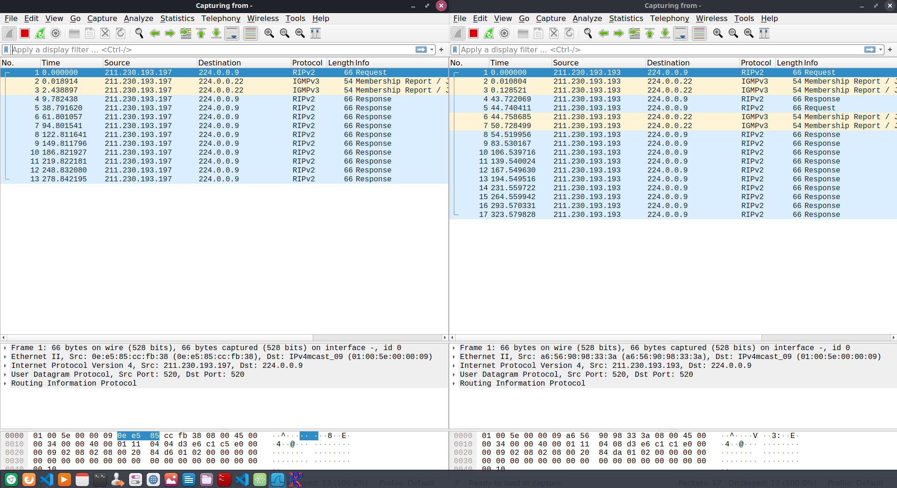

nous pouvons voir le fichier de capture wireshark (dans `wireshark/rip`): `(R1-eth0) RIP.pcapng` et `(R1-eth1) RIP.pcapng`

### 5) Que contiennent les réponses RIP envoyées sur a ? Sur b ?

Les réponses RIP envoyées sur a :

- Le route tag
- l'adresse réseau de b.
- Le Netmask (255.255.255.252)
- L'adresse du prochain saut pour aller à b
- Une metric qui vaut 1

Les réponses RIP envoyées sur b :

- Le route tag
- l'adresse réseau de a.
- L'adresse du prochain saut pour aller à a
- Le Netmask (255.255.255.252)
- Une metric qui vaut 1

### 6) Sur R2 et R3, activez RIP sur les réseaux directement connectés à ces routeurs. Quel est l’intérêt du message de requête ?

```bash
R2:~# zebra -d
R2:~# ripd -d
R2:~# vtysh

Hello, this is Quagga (version 0.99.10).
Copyright 1996-2005 Kunihiro Ishiguro, et al.

R2# configure terminal
R2(config)# router rip
R2(config-router)# network 211.230.193.194/30
R2(config-router)# network 211.230.193.1/25
R2(config-router):# exit
R2(config):# exit

R3:~# zebra -d
R3:~# ripd -d
R3:~# vtysh

Hello, this is Quagga (version 0.99.10).
Copyright 1996-2005 Kunihiro Ishiguro, et al.

R3# configure terminal
R3(config)# router rip
R3(config-router)# network 211.230.193.198/30
R3(config-router)# network 211.230.193.129/26
R3(config-router):# exit
R3(config):# exit
```

Pour qu'on peut savoir les routeurs diffusent de nouveaux reseaux.

### 7) Quelles sont les différences entre le contenu des réponses envoyées par R1 et sa table de routage ? Pourquoi y a-t-il des différences ?

Les différences sont au niveau des réseaux `b` et `B`, il y a des différences dans l'addition des différents routeurs.

|           Wireshark           |         ip route          |
| :---------------------------: | :-----------------------: |
| 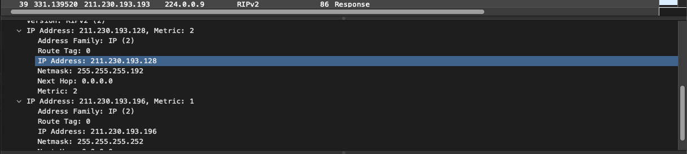 | 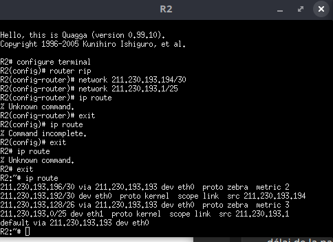 |

On peut voir avec la commande `ip route` dans R2 et les métriques pour les réseaux `b` et `B` sont respectivement à 2 et 3.

### 8) Quelle est la métrique associée au réseau A dans les annonces de R2 ? Quelle est la métrique associée au réseau A dans les annonces de R1 ? Selon vous, quelle est la métrique associée au réseau A dans les annonces de R3 ? A quoi correspond la métrique ?

- la métrique associée au réseau A dans les annonces de R2 : 1
- la métrique associée au réseau A dans les annonces de R1 : 2
- la métrique associée au réseau A dans les annonces de R3 : 3

La métrique est de routeur nécéssaire à parcourir pour atteindre une destination depuis la source (Hop Count)

### 9) Affichez la table de routage de chaque routeur et vérifiez que les métriques associées aux différentes routes correspondent à votre réponse à la question précédente. Selon vous, si on ajoutait un lien direct entre R2 et R3, quelle serait la métrique associée au réseau A sur R3 ?


Les métriques associées aux différentes routes correspondent à mon réponse à la question précédente et si on ajoutait un lien direct entre R2 et R3 la métrique associée au réseau A sur R3 serait 2.

### 10) Simulez une panne de l’interface eth1 de R2 en la désactivant. Que remarquez-vous au sujet des messages RIP reçus et envoyés par R1 ? Quelle est la métrique associée au réseau A désormais inaccessible ? Pourquoi cette valeur est-elle utilisée ? Que signifie-t-elle ? Quel est le délai entre la panne et la suppression de la route vers A dans R3 ?

Désactiver l'interface eth1 de R2 :

```bash
R2:~# ip link set dev eth1 down
```

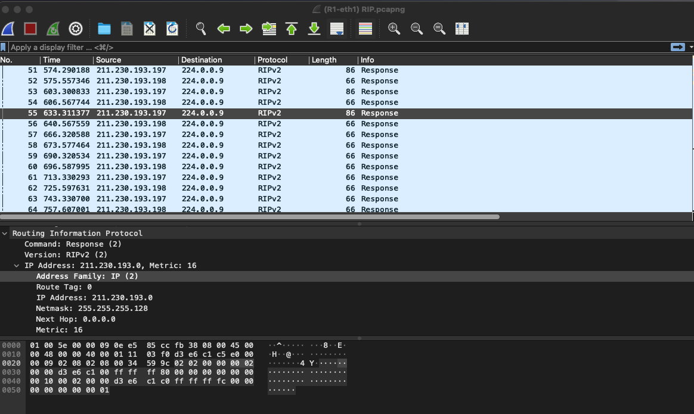

La métrique associée devient 16 car le réseau A est inaccessible. Cette valeur est utilisée parce que le nombre de saut maximum réalisable par RIP est de 15. Les réseaux avec un nombre de sauts de 16 ou plus sont considérés comme inaccessibles. Le délai de la panne et la suppression de la route vers A dans R3 est plus moins 30 secondes.

### 11) Activez de nouveau eth1 sur R2. Désactivez cette fois-ci eth0. R2 n’envoie plus de messages RIP vers R1. Attendez quelques minutes en scrutant les annonces de R1. Au bout de combien de temps (timeout) R1 considère que R2 (et donc A) est inaccessible ?

```bash
R2:~# ip link set dev eth1 up
R2:~# ip link set dev eth0 down
```

R1 considère que R2 (et donc A) est inaccessible out au bout d'environ 3 minutes.

### 12) Activez de nouveau eth0 sur R2. Créez un 4ème routeur nommé PIRATE avec une interface eth0 connectée au réseau A. Configurez l’interface eth0 avec une adresse appartenant à A et vérifiez que vous pouvez envoyer un ping à R2.

```bash
R2:~# ip link set dev eth0 up
```

Dans le terminal linux :

```bash
$ vstart -D PIRATE --eth0=A
```

Configuration de PIRATE :

```bash
PIRATE:~# ip link set dev eth0 up
PIRATE:~# ip addr add 211.230.193.5/25 dev eth0
```

Comme vous pouvez voir, le ping à la routeur R2 fonctionne :

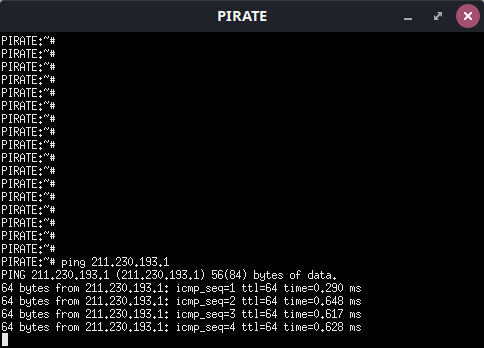

### Créez maintenant une interface réseau fictive nommée dummy0 avec la commande ifconfig. Associez à cette interface une adresse appartenant au réseau B. Activez RIP. Affichez la table de routage de R2. Que constatez-vous concernant le réseau B ? Comment remédier à ce problème ?

Configuration une nouvelle interface dummy0 :

```bash
PIRATE:~# ifconfig dummy0
```

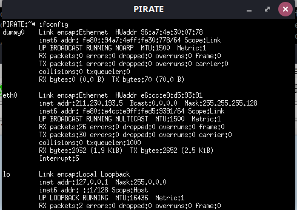

```bash
PIRATE:~# ip link set dev dummy0 up
PIRATE:~# ip addr add 211.230.193.130/26 dev dummy0
```

Configuration RIP sur PIRATE :

```bash
PIRATE:~# zebra -d
PIRATE:~# ripd -d
PIRATE:~# vtysh

Hello, this is Quagga (version 0.99.10).
Copyright 1996-2005 Kunihiro Ishiguro, et al.

PIRATE# configure terminal
PIRATE(config)# router rip
PIRATE(config-router)# network 211.230.193.0/25
PIRATE(config-router)# network 211.230.193.128/26
PIRATE(config-router):# exit
PIRATE(config):# exit
```

La table de routage de R2 :

```bash
R2:~# ip route
```

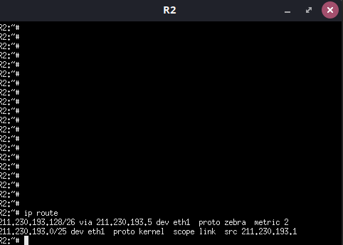

La métrique concernant le réseau B n'a pas bouger, mais si on active l'interface dummy0 la métrique va diminuer et passer de 3 à 2.

# 5. NAT (en bonus)

Chaque commande lance un routeur et une console qui vous permet de configurer le routeur.

```bash
$ vstart -D box --eth0=L2 --eth1=L1
$ vstart -D PC --eth0=L1
$ vstart -D R-FAI --eth0=L2
```

ou vous pouvez simplement utiliser cette commande :

```bash
$ ./nat.sh
```

Avant de configurer chaque routeur, nous devons activer les interfaces en utilisant cette commande `ip link set dev <interface> up`. Et après la configuration, nous pouvons utiliser la commande `ip route` pour vérifier si l'IP est correcte ou non.

### 1) Définissez un plan d’adressage IPv4 privé pour le réseau interne (voir schéma), configurez les interfaces.

Et pour configurer, utilisez cette commande :

```bash
box:# ip addr add dev eth1 211.230.193.197/30

PC:# ip addr add dev eth0 211.230.193.198/30
```

### 2) Définissez un réseau IPv4 public pour le réseau externe (voir schéma), configurez les interfaces.

```bash
box:# ip addr add dev eth0 211.230.193.193/30

R-FAI:# ip addr add dev eth0 211.230.193.194/30
```

### 3) Aidez-vous de la documentation de netfilter pour configurer une translation d’adresse de manière à ce que le PC puisse communiquer avec le routeur du FAI : https://www.netfilter.org/documentation/HOWTO/fr/NAT-HOWTO-6.html

```bash
PC:# iptables -t nat -A PREROUTING -i eth0 -j DNAT --to 211.230.193.197
box:# iptables -t nat -A PREROUTING -i eth0 -j DNAT --to 211.230.193.194
```

### 4) Envoyez des requêtes d’echo ICMP depuis le PC vers R-FAI. Quelles routes faut-il configurer sur la box, le PC et R-FAI pour que la communication puisse se faire entre le PC et R-FAI ?

```bash
box:# ip route add 211.230.193.0/25 dev eth0 via 211.230.193.194
box:# ip route add 211.230.193.128/26 dev eth1 via 211.230.193.198

PC:# ip route add 0.0.0.0/0 dev eth0 via 211.230.193.197
```

```bash
PC:# traceroute -I icmp -q 1 211.230.193.194
```

### 5) Faites une capture de trames sur les interfaces eth0 et eth1 de la box en exécutant les 4 commandes suivantes :

- sur la box :

```bash
box:~# tcpdump -Uni eth0 -w /hosthome/box_eth0.cap &
box:~# tcpdump -Uni eth1 -w /hosthome/box_eth1.cap &
```

- sur la machine physique (par exemple a13p16) :

```bash
a13p16> tail -n+0 -f ~/box_eth0.cap | wireshark -SHkli - &
a13p16> tail -n+0 -f ~/box_eth1.cap | wireshark -SHkli - &
ou
a13p16> ./wireshark_nat.sh
```

#### Quelle est l’adresse source du paquet IP reçu de la part du PC ?

`211.230.193.198` ?
